# Ballers Project1 "Do You Really Know The NBA?"
### _By: Vena Li, Sharifah Sinclair, George Redak, Jim Tran_
#### _Nov. 12, 2020_

### Initial Proposal
#### Group Name: Ballers Stats: NBA Members: Jim Tran, Vena Li, Sharifah Sinclair, George Redak 

#### Questions: 
 * What position is the most valuable on the court? 
 * Which traditional stat is most important? 
 * Which advanced stat is most important? 
 * What player is the best over the period looked at?
 * Can you tell anything about coaching by looking at stats alone?
 * What team has had the most success over the period studied?

#### Data sources: 
*This will give us api, csv and json. We can even map shots with locations data. NBA API Basketballrefernce.com* 
*Roles: George - Pulling data Sharifah - Cleaning and data exploration* 
*Jim - Analysis* 
*Vena - Visualization Written analysis* 

#### *Group Goal: Our project is to determine what patterns have taken place over the last 30 years of NBA that have led to such an increase in total statistics per player (and* *by how much). We will analyze data looking at traditional and advanced stats to determine what patterns are present in teams that are successful, as well as players who are* *successful.*

=================================================================================================================================================================================

### Topic: “Do You Really Know The NBA?”

*The NBA is full of interesting statistics and data available for data analysis.  We picked this topic as basketball fans and as sports fans in general who want to try and make sense of the data and its impact on the game.
We looked at how game statistics impact the game; specifically, which player positions is most valuable; what traditional and advanced statistics by players and by teams is more meaningful; as well as a look at player salaries through the decades.
We extracted data from Dataworld, Kaggle and NBA API calls to answer the questions.  First, we looked at the data for the most valuable positions.   For this we took the mean of the winning shares for the five common positions (point guard, shooting guard, small forward, power forward, center) for players from 1978 to 2015.   Next, we compared the traditional statistics such as points, assists, field goals and rebounds to team wins from 2014 to 2018.  Team points and team wins were extracted from 2 different sources and merged into one dataframe for analysis and graphing.  We then looked at advanced statistics such as Tm, PER, BPM, VORP, WS, Team Mar by players and from 1985 onwards was extracted and transformed for analysis and graphing.  We also looked at the player’s playoff performance and how it affects team winss.  Next we took a look at  the player’s heights, age and weights over the 5  decades: 1980, 1990, 2000 and 2010.  Next, we compared the movements of the player’s salaries over the same decades.  Finally, we include some fun facts to compare LeBron James and Michael Jordan’s statistics and attempt to answer who is the G.O.A.T.* 

#### Questions to Answer and Analysis:

#### What position is the most valuable on the court? - Vena
 * Data needed: player positions: center, point guard, power forward, shooting guard, small forward
 * multi line graph with position means from 1980 to 2015 

*We first decide to drop The data of the year 2016 from the dataset since it seems incomplete, and only focus on the period 1978-2015. Then we Group the data by year and         position and then we made this line plot to visualize our data.  As you may tell, we were not able to find any specific trend but we do find out something interesting. We      found out that “Center” is the most valuable position during 1978-1986. In fact, after we generate the average W/S for each position “Center” is also the most valuable position in general. Our other discovery is that the W/S for every position Dropped dramatically in 1999 and 2012, we believe that is due to a salary negotiation and the season becoming shorter.*
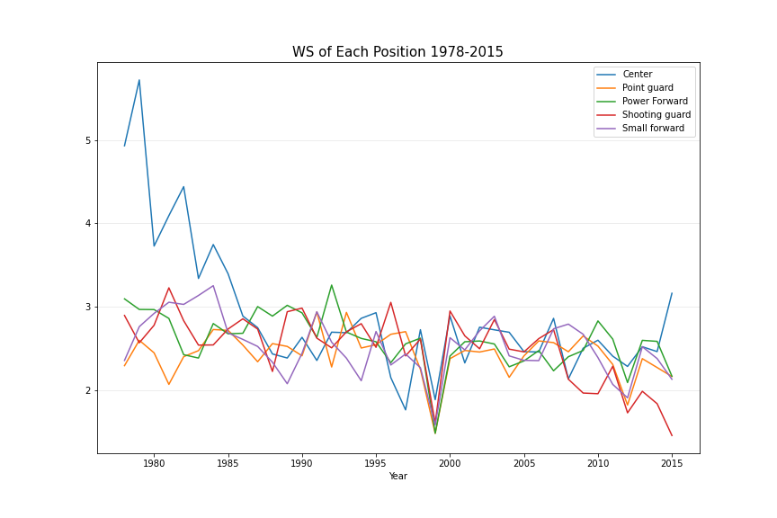 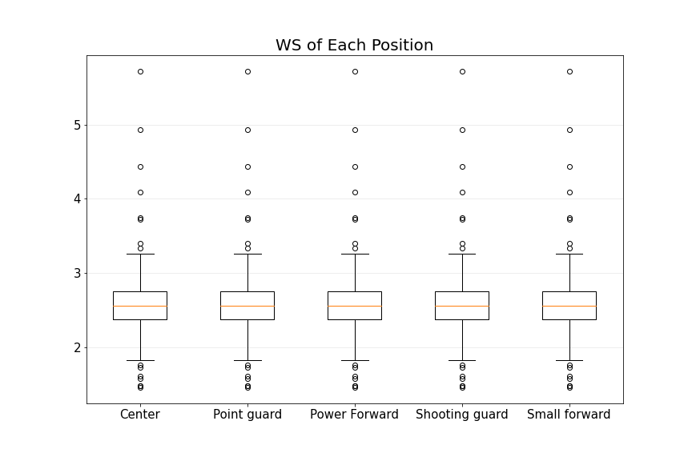

#### Which traditional stat is most important? - Jim
 * Data Needed: player name, points, assists, rebounds, FG%, team margin
 * Find correlation between winning and an imputed stats (points, assists, rebounds, FG%) with scatter plot

*To analyze this extracted separate datasets for team points and for team wins then merged them by year and team abbreviations for a complete dataframe that is made up of Teams, Wins, Points, Assists, Field Goal and Rebounds.  Some of the data cleansing include converting data types from integer to object, from null to 0 values for summing, consolidating wins only, changing the seasons formats from (YYYY-MM) to YYYY and replacing team abbreviations for consistency.  The correlation between wins and each of the statistics is approximately 0.96 which suggests a strong positive relationship between wins and each of the statistics.  Team wins increase with higher/more points, assists, field goals, and rebounds.  And the last graph shows the same movement in data points.  Therefore, with the given data, it is inconclusive to determine that one statistic is more important over another, they all contribute to a team’s win.  This is evident in the multi line graph of statistics with the wins bar graph, as the statistics trend with the wins.*

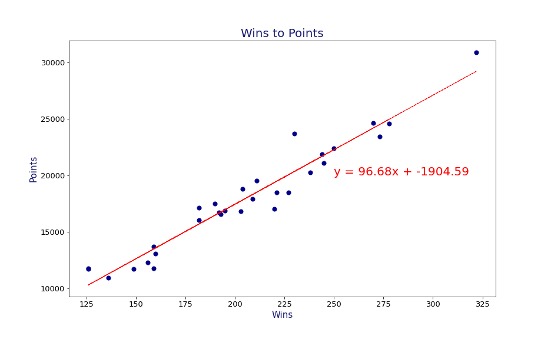  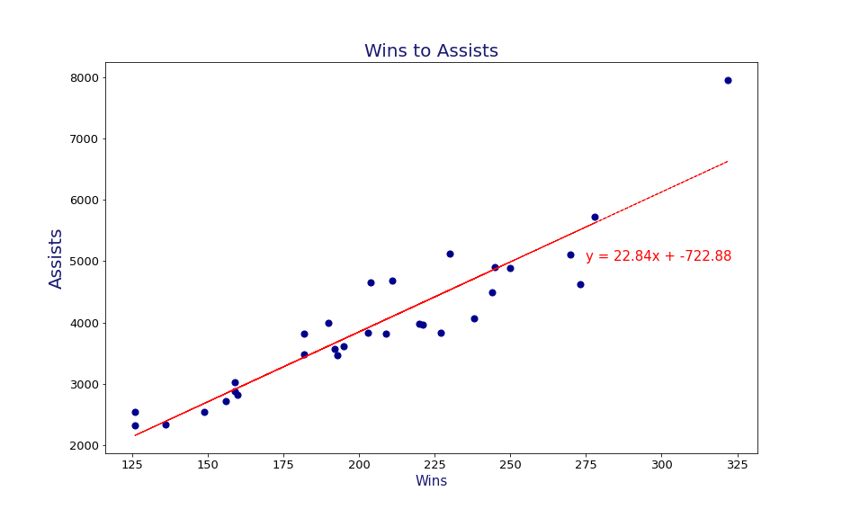
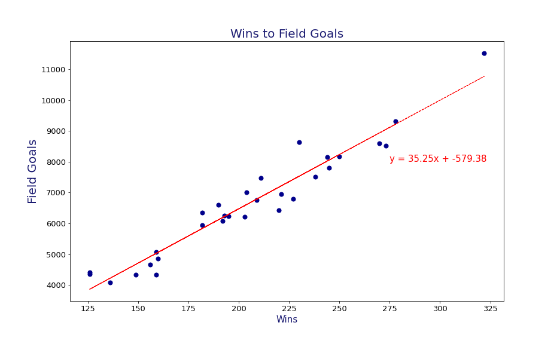  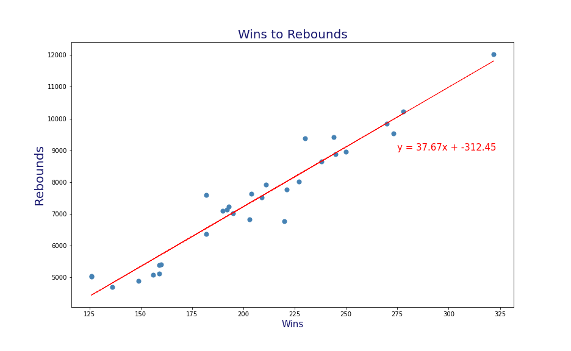
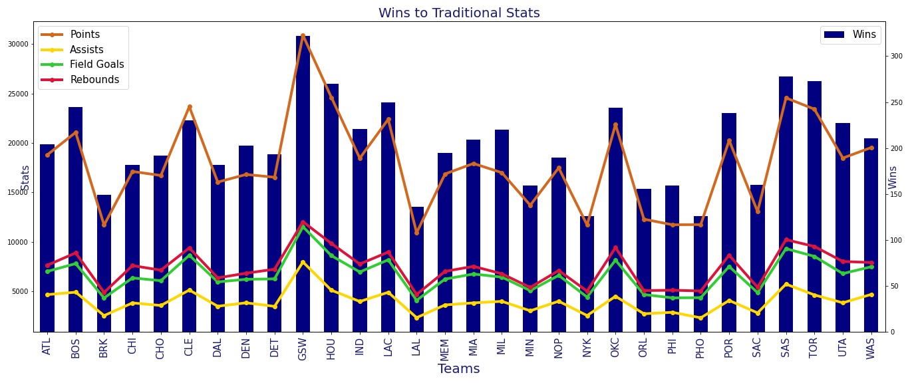

#### Which advanced stat is most important?  - George
 * Data Needed: Player Name, PER, BPM, WORP, Team Margin
 * Find correlation between winning and advanced stat(PER, BPM, WORP) with scatter plots
 
  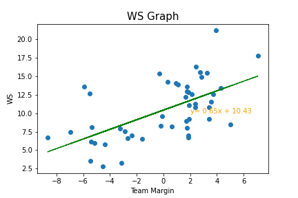
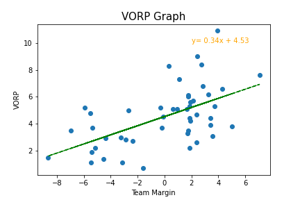  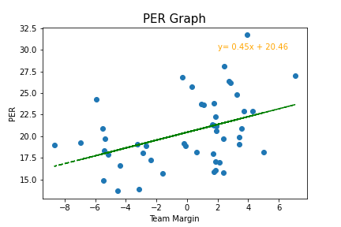

#### Playoffs Performances - Sharifah
 * Data needed: Playoffs players, Team name, All-time games won, all-time win percentage and differential (Points for - Points Allowed) 
 * Rank the top 10
 * Looking at point differential for all teams ever, chart the top 20
 * scatter plot with regression
 
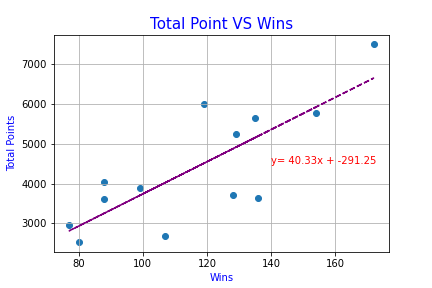  
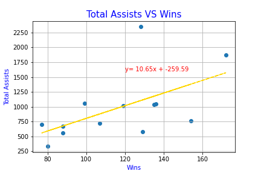  
 
#### What decade was the tallest? What decade was the heaviest? -Sharifah 
 * Data Needed: Name, time(group by decades), height, age and weight
 * Dual bar graph showing weight and age by decades
 * multi-line and multi-bar graphs
 
  

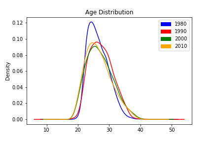  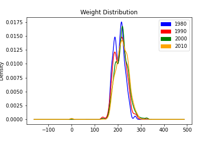

#### Show salary evolution - George
  * Create bin for different salary range
  * line and bar graphs (show percent of players in each salary range)
  
 

#### Fun Facts: player height, age and weight - George
  * Data needed: points, assists, rebounds, blocks, field goals and steals for LeBron James and Michael Jordan
  * side-by-side bar graphs
  
.png) .png)

#### Discussion:
  * The biggest take away from this analysis is the lack of evidence to support that great statistical achievements from individuals creates a winning team. 
  * Per Game individual averages (advance or traditional)  almost have no correlation to the team winning, in the playoffs or otherwise
  * Totals is the biggest indicator of a player’s ability to win.
  
#### Post Mortem
  * One issue was navigating the NBA API. Calling players by their id was the only way to get data, and this was a tedious process
  * Finding specific playoffs data was very difficult. We created our own dataframe from NBA API for this. 
  *The question of how important a player is to their team can be further explored by looking at data specific to lineup combinations. This would be a next step, looking            specifically at players and positions when they are on the court vs. off the court.

